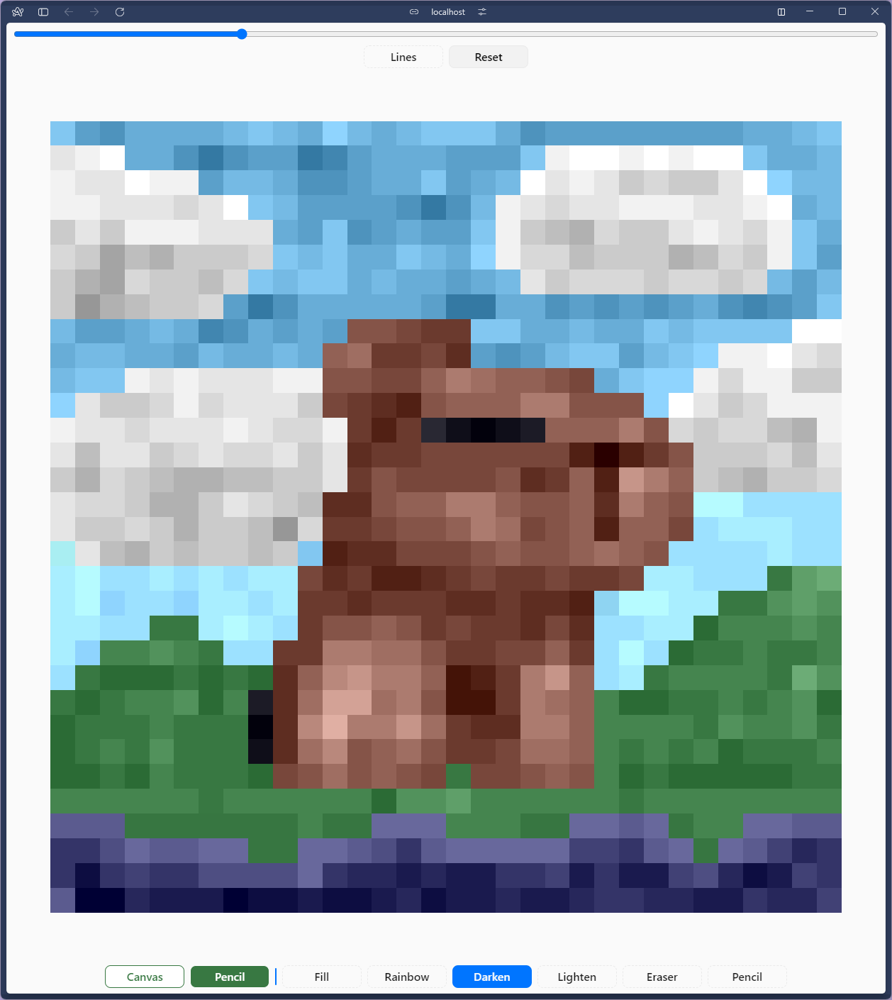

# Etch a Sketch

This project is a part of [The Odin Project's Foundations course](https://www.theodinproject.com/paths/foundations/courses/foundations).

> [Live Demo](https://lernywensi.github.io/etch-a-sketch)

## About

Etch a Sketch is a simple browser version of a game inspired by the classic [Etch A Sketch toy](https://en.wikipedia.org/wiki/Etch_A_Sketch).

## Built with

-   HTML
-   CSS
-   JavaScript

## Features

-   Custom color selection for pencil and canvas
-   Area filling functionality
-   Rainbow mode with randomly selected colors for each cell
-   Eraser tool
-   Darkening tool
-   Lighting tool

## Preview | [Live](https://lernywensi.github.io/etch-a-sketch)

<i>Capybara 👉👈</i>

